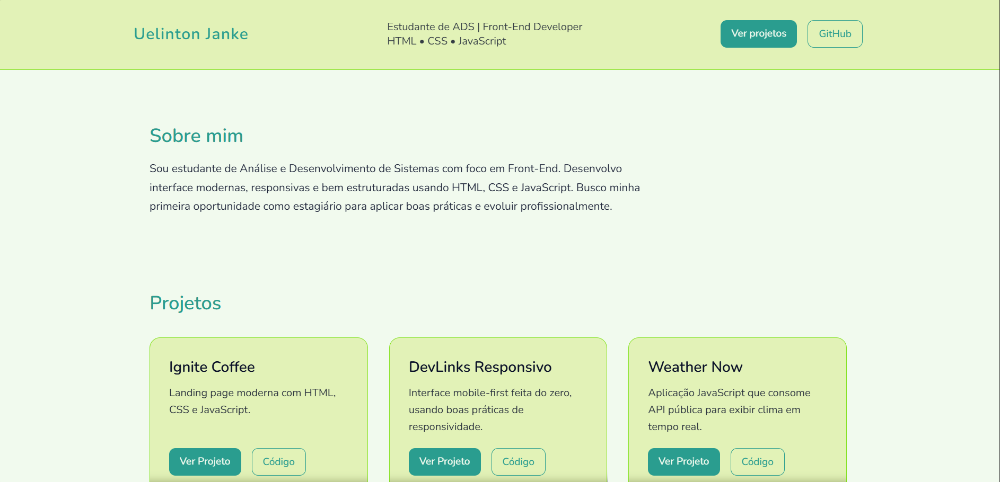

# 💼 [Portfólio - Uelinton Janke](https://portfolio-uelinton.vercel.app/)

Portfólio pessoal desenvolvido para apresentar minhas habilidades como **Desenvolvedor Front-End**, meus principais projetos e forma de contato.
O foco é oferecer uma navegação clara, moderna e responsiva, pensada especialmente para **recrutadores e oportunidades de estágio**.

---

## 🚀 Funcionalidades

- Layout moderno, limpo e responsivo
- Estrutura semântica com HTML5
- Seções bem definidas: Sobre, Projetos e Contato
- Cards de projetos com links para **deploy** e **repositório**
- Animações leves para melhor experiência do usuário
- Design pensado para leitura rápida por recrutadores

---

## 🛠️ Tecnologias utilizadas

- **HTML5**
- **CSS3**
- **Git & GitHub**
- **Vercel** (deploy)

---

## 📂 Projetos em destaque

- **Ignite Coffee** <br>
Landing page moderna com HTML, CSS e JavaScript.
🔗 https://ignite-coffee-landing-page.vercel.app/

- **DevLinks** <br>
Interface mobile-first feita do zero, usando boas práticas de responsividade.
🔗 https://devlinks-responsivo.vercel.app/

- **Weather Now** <br>
Aplicação JavaScript que consome API pública para exibir clima em tempo real.
🔗 https://weather-now-jade-seven.vercel.app/

- **Aurum Headphones** <br>
Landing page premium desenvolvida com HTML e CSS, focada em design moderno e responsividade.
🔗 https://aurum-landing-ebon.vercel.app/

- **To-Do List JS** <br>
Lista de tarefas interativas com JavaScript puro, manipulação do DOM e persistência com localStorage.
🔗 https://to-do-list-js-pi-five.vercel.app/

- **Portfólio Alex Moretti** <br>
Site de um artista fictício criado para praticar layout, grid, flexbox, estruturação visual e responsividade utilizando Bootstrap.
🔗 https://portfolio-alex-moretti.vercel.app/

---

## 🎥 Demonstração



---

## 📦 Como executar o projeto localmente

```
git clone https://github.com/UelintonHJ/portfolio-uelinton.git
cd portfolio-uelinton
```
Abra o arquivo index.html no navegador
Ou acesse diretamente:
https://portfolio-uelinton.vercel.app/

---

## 📚 Aprendizados

Durante o desenvolvimento deste portfólio, aprofundei conhecimentos em:
- Estruturação semântica com HTML
- Organização e reutilização de estilos CSS
- Layouts responsivos com Flexbox e Grid
- Animações leves com CSS
- Boas práticas de versionamento com Git e GitHub
- Criação de portfólio focado em **recrutadores**

---

## 🧑‍💻 Autor

**Uelinton Janke**
🎓 Estudante de Análise e Desenvolvimento de Sistemas
💻 Foco em Front-End
LinkedIn: https://www.linkedin.com/in/uelinton-janke/
